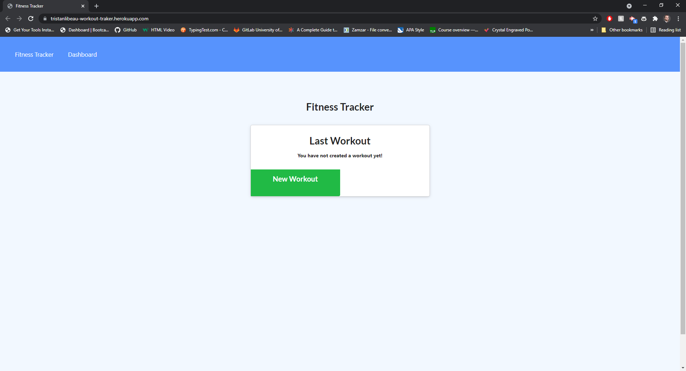

# Workout-Tracker

## Introduction

Workout-Tracker:

This application is a simple app where you can manage your workout sessions.

## Links

* URL of my Repository:

https://github.com/TristanLibeau/Workout-Tracker

* Live url on Heroku:

https://tristanlibeau-workout-traker.herokuapp.com/

## Functionality:

* WHEN I open the application in the browser THEN I am presented with a data summary of the last workout which displays the sum of the exercises criteria such as Date, Total Workout Duration, Exercises Performed, Total Weight Lifted, Total Sets Performed and Total Reps Performed

* WHEN I see the page which summarizes the last workout data THEN I can choose to either create a New Workout Plan or Continue the last workout plan

* WHEN I click on the "new workout" button THEN I can add a new exercise

* WHEN I decide to add a new exercise I can choose from two different exercise types which are cardio and resistance

* WHEN I choose my exercise to be cardio THEN I can enter the name, distance and duration of the exercise

* WHEN I choose my exercise to be resistance THEN I can enter the name, weight, sets, reps and duration of the exercise

* WHEN I insert all values in the input fields THEN I can choose to complete the workout plan and the exercise gets added to the workout and I will be redirected to the page where the workout summary is displayed. I can then see that my new exercise has been added to the workout. If I choose to add an exercise than I stay on the same page in order to be able to add more exercises to the workout and my exercise I have created gets added to the workout plan

* WHEN I click in the Dashboard Navbar element THEN I am taken to a page which shows to graphs. The first graph shows the Workout durations in minutes for the past 7 days and the second graph shows the weight lifted over the past 7 days.

## Mock-Up 

* The following Image shows the final application

## Credits

* StackOverflaw 
* BootCamp Course
* https://www.mongodb.com/developer/how-to/use-atlas-on-heroku/